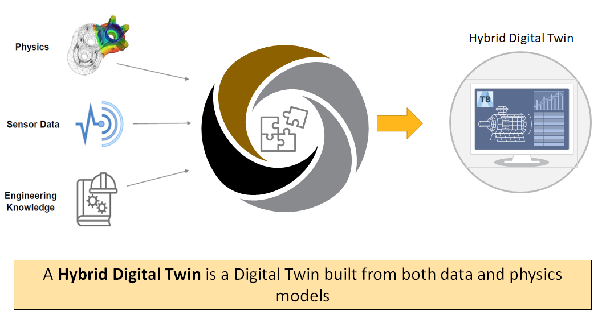

PyTwin documentation |version|
================================

.. toctree::
   :hidden:
   :maxdepth: 2

   getting_started/index
   user_guide/index
   api/index
   examples/index
   contributing

Introduction
------------

An analytics-driven, simulation-based digital twin is a connected, virtual replica of an
in-service physical asset in the form of an integrated multi-domain system simulation that
mirrors the life and experience of the asset. Ansys Digital Twins enable system design and
optimization as well as predictive maintenance, to optimize industrial asset management.
By implementing Ansys Digital Twins, you can improve top-line revenue, manage bottom-line
costs, and both gain and retain competitive advantages.

Ansys Twin Builder and Ansys Twin Deployer are open solutions that allow engineers to create
digital twins and export them in the form of deployable twin runtimes.

What is PyTwin?
-----------------
PyTwin is part of the `PyAnsys <https://docs.pyansys.com>`_ ecosystem that
lets you deploy twin runtimes within a Python environment of your choice in
conjunction with other PyAnsys libraries and external Python libraries.

PyTwin implements different modules to facilitate the consumption of twin runtimes.
It gives access to core runtime functionalities as well as a higher-level abstraction
class offering Python interfaces that can be used in any client code for workflow development
and twin runtime integrations. Using PyTwin, you can programmatically interact with and
control the execution of twin runtimes.

Features
--------
Some of the many features in the PyTwin package, ``pytwin``, allow you to:

- Use twin runtime functionalities to build your own consumption workflows based on
  atomic API calls. For more information, see :ref:`ref_index_api_sdk`.
- Access and use the higher-level abstraction implementation of consumption workflows to
  directly use and integrate twin runtimes. For more information, see
  :ref:`ref_index_api_evaluate`.
- Become familiar with PyTwin functionalities by exploring the multiple examples that are available.
  For more information, see :ref:`ref_example_gallery`.

Documentation and issues
------------------------
In addition to :ref:`getting_started` and :ref:`ref_user_guide` sections, the PyTwin
documentation provides :ref:`ref_index_api`, :ref:`ref_example_gallery`,
and :ref:`ref_contributing` sections.

On the `PyTwin Issues <https://github.com/pyansys/pytwin/issues>`_ page, you can create
issues to submit questions, report bugs, and request new features. To reach
the PyAnsys support team, email `pyansys.support@ansys.com <pyansys.support@ansys.com>`_.

License
-------
PyTwin is licensed under the MIT license.

PyTwin makes no commercial claim over Ansys whatsoever. This library
extends the functionality of Ansys Twin Builder and Twin Deployer by adding
a Pythonic interface to twin runtimes without changing the
core behavior or license of the original software. The interactive
control of twin runtimes through PyTwin may require a license of
Twin Deployer depending on the case, see :ref:`getting_started` section for more information.

For more information on both Ansys Twin Builder and Twin Deployer, see
`Ansys Twin Builder <https://www.ansys.com/products/digital-twin/ansys-twin-builder>`_
on the Ansys website.

Project index
-------------

* :ref:`genindex`
